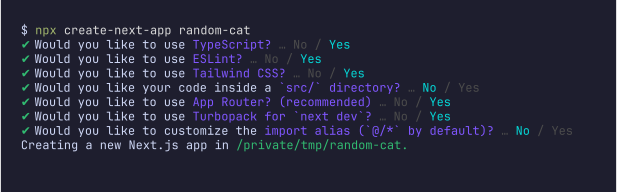
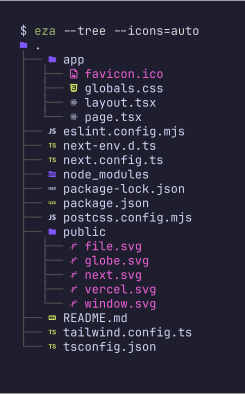
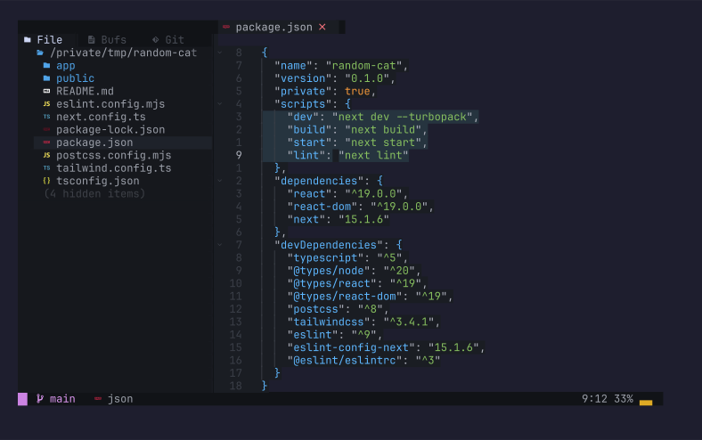
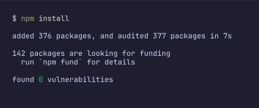
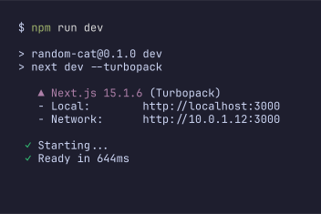

# terminal-svg-screenshot

A tool for creating beautiful SVG screenshots. Easily capture terminal output in SVG format to create high-quality, editable screenshots perfect for documentation and blog posts.

[日本語版のREADME](README-ja.md)

## Requirements

- nix (with flakes enabled)
- Terminal app with adjustable window size
  - Use a terminal that doesn't have fixed width settings (like visor mode)
  - Recommended: Ghostty, Hyper
    - `brew install --cask ghostty`
    - `brew install --cask hyper`

## Usage

### 1. Repository Setup

Clone the repository with the following commands:

```zsh
git clone https://github.com/suin/terminal-svg-screenshot.git
cd terminal-svg-screenshot
```

### 2. Creating Screenshots

You'll need two terminal windows:

1. Model Terminal: The terminal where you'll execute the commands you want to capture
2. Photographer Terminal: The terminal that will output the SVG file

#### Preparing the Model Terminal

1. Open your terminal app (avoid iTerm2; use an app that allows window size adjustment)
2. Run the following command:
   ```zsh
   nix develop .#start
   ```
3. Execute the commands you want to capture
4. Adjust the window size and font size to fit your content perfectly
5. Keep the window configuration as is once you're satisfied

#### Taking the Screenshot

In the Photographer Terminal, follow these steps:

1. Open a new terminal and run:
   ```zsh
   nix develop
   ```

2. Generate the SVG file:
   ```zsh
   tmux capture-pane -pet 0 | freeze -c ./freeze.json -o output.svg
   ```

For prompt line adjustments, use these commands:

- To exclude the last prompt line:
  ```zsh
  tmux capture-pane -pet 0 | head -n -1 | freeze -c ./freeze.json -o output.svg
  ```

- To fine-tune the number of trailing lines (adjust while checking output):
  ```zsh
  tmux capture-pane -pet 0 | head -n -10
  ```

#### SVG Post-processing

To prevent font issues across different environments, it's recommended to convert text to outlines:

```zsh
inkscape --export-text-to-path output.svg -o output-outlined.svg
```

You can perform additional editing in Figma or Illustrator if needed.

## Customization

### Theme Configuration

Customize the terminal appearance in `freeze.json`:

- Background color
- Text color
- Font size
- Other settings

For more details, refer to the [freeze documentation](https://github.com/charmbracelet/freeze).
Available themes can be found [here](https://xyproto.github.io/splash/docs/all.html).

### Changing Fonts

The default font is JetBrainsMono Nerd Font Mono. To change the font:

1. Modify the `font` setting in `freeze.json`
2. Add your desired font to `flake.nix`:

```nix
tools = with pkgs; [
  tmux
  charm-freeze
  fish
  inkscape
  fontconfig
  nerd-fonts.jetbrains-mono
  # Add your new font here
];
```

## Gallery

The following screenshots were created using sample commands from this repository:










